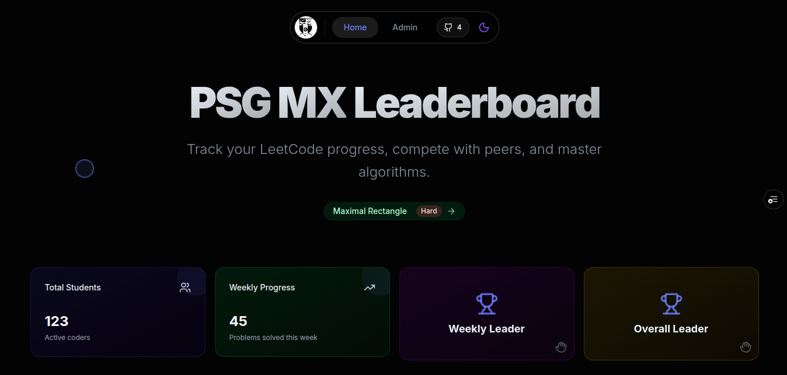
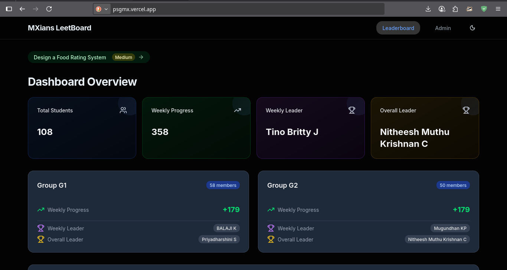

# PSGMX Leaderboard

<div align="center">


<br/>

**The ultimate competitive programming tracker for PSG 2025 MX batch.**
<br/>
Real-time stats, dynamic leaderboards, and detailed analytics for LeetCode progress.

</div>

---

### **New Gen-Z UI (Current)**
> *Featuring glassmorphism, fluid animations, and a focus on UX.*



### **Legacy UI (Previous)**
> *Where it all started.*



---

## Key Features

- **Live Leaderboard**: Updates in real-time with granular ranking logic (Weekly > Overall > Roll No).
- **Problem of the Day (POTD)**: Integrated daily LeetCode challenge banner to keep the streak alive.
- **Advanced Analytics**:
    - **Group Stats**: G1 vs G2 competitive analysis.
    - **Interactive Charts**: Visual progress tracking using Recharts.
- **Smart Search & Filter**: Instant lookup by Name, Roll Number, or Class Group.
- **Instant Refresh**: On-demand data synchronization for individual profiles.
- **Dark/Light Mode**: Fully responsive theme support with high-contrast visibility.

---

##Tech Stack

| Component | Technology |
|-----------|------------|
| **Framework** | Next.js 15 (App Router) |
| **Language** | TypeScript |
| **Styling** | Tailwind CSS + Shadcn/ui |
| **Animations** | Framer Motion |
| **Database** | Supabase (PostgreSQL) |
| **Deployment** | Vercel |

---

## IV. 🤝 Contribution Guide

We welcome contributions to make this platform even better!

### 1. Prerequisites
- Node.js 18+
- npm or pnpm

### 2. Setup

```bash
# Clone the repository
git clone https://github.com/yourusername/psgmx-leetcode.git

# Navigate to directory
cd psgmx-leetcode

# Install dependencies
npm install

# Set up environment variables
# Create a .env.local file with your Supabase credentials
# NEXT_PUBLIC_SUPABASE_URL=...
# NEXT_PUBLIC_SUPABASE_ANON_KEY=...

# Run development server
npm run dev
```

### 3. How to Contribute

1.  **Fork** the project.
2.  Create your feature branch: `git checkout -b feature/AmazingFeature`.
3.  Commit your changes: `git commit -m 'Add some AmazingFeature'`.
4.  Push to the branch: `git push origin feature/AmazingFeature`.
5.  Open a **Pull Request**.

---

<div align="center">
Built with ❤️ by the PSGMX Team
</div>
